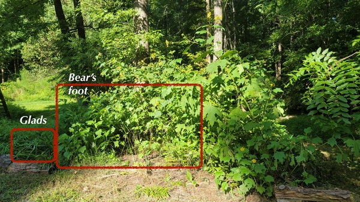
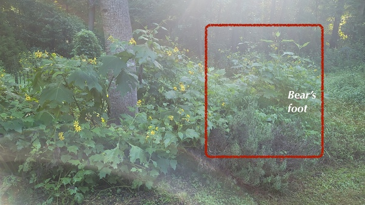
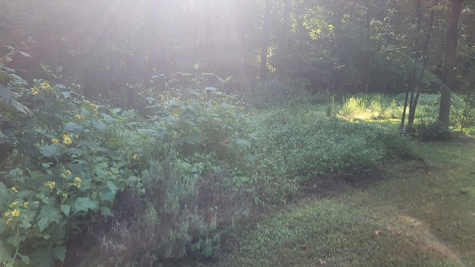
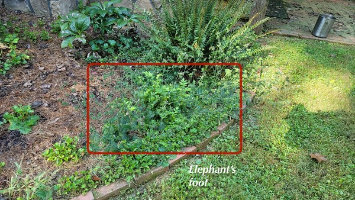
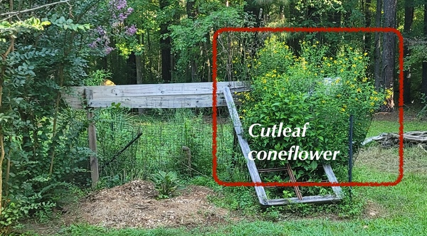
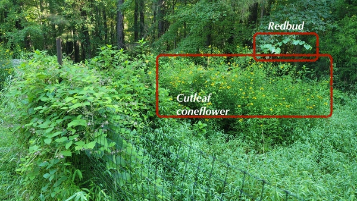
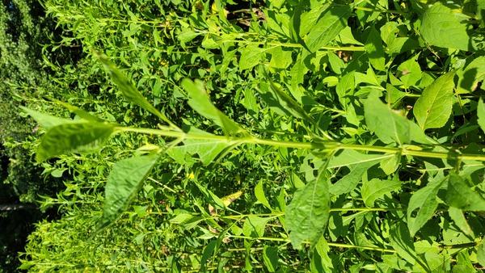
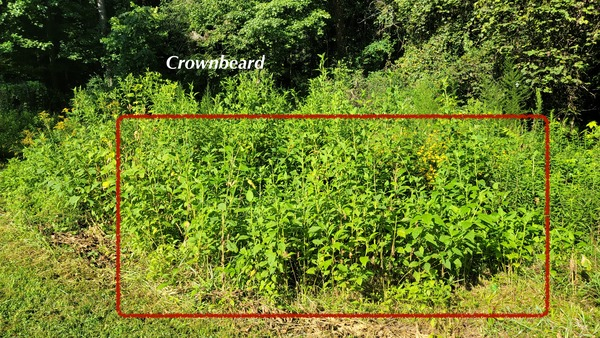
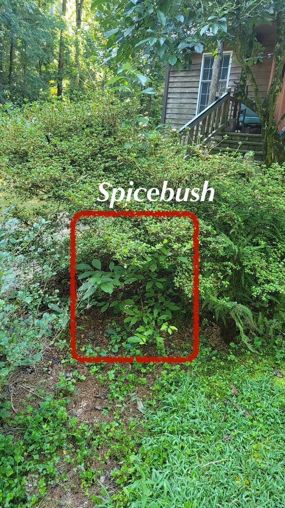

# 2024 autumn plant availability

Updated 2024-08-24 20:17:43

Seeds to be shared by cutting off the fruiting stems (you can carefully separate them in your garden). 

|  |  | Offering | Origin | For size, habit |
|---|---|---|---|---|
| _Cercis canadensis_ | redbud | plants | wild seedlings | [NCSU plant toolbox](https://plants.ces.ncsu.edu/plants/cercis-canadensis/) |
| _Gladiolus_| gladiolus | bulbs | previous owner ||
| _Lindera benzoin_ | spicebush | plant | wild seedling | [NCSU plant toolbox](https://plants.ces.ncsu.edu/plants/lindera-benzoin/) |
| _Phytolacca americana_ | pokeweed | plant | wild | [NCSU plant toolbox](https://plants.ces.ncsu.edu/plants/phytolacca-americana/) |
| _Rudbeckia laciniata_ | cutleaf coneflower | plants, seeds | hitch hiker on plant from Cure? | [NCSU plant toolbox](https://plants.ces.ncsu.edu/plants/rudbeckia-laciniata/) |
| _Saururus cernuus_ | lizard's tail | plants | from Dutch Buffalo nursery | [NCSU plant toolbox](https://plants.ces.ncsu.edu/plants/saururus-cernuus/) |
| _Smallanthus uvedalia_ | bear's foot | plants, seeds | wild, now curated | [NCSU plant toolbox](https://plants.ces.ncsu.edu/plants/smallanthus-uvedalia/) |
| _Verbesina occidentalis_ | small yellow crownbeard | plants, seeds | wild, now curated | [NCSU plant toolbox](https://plants.ces.ncsu.edu/plants/verbesina-occidentalis/) |

Happy for donations of the following

* _Packera aurea_ (golden ragwort, golden groundsel)
* _Liatris spp_ (blazing stars, gay feather )

## Notes on the plants

_Gladiolus_ are most likely a pink mid May, possibly a later season apricot/peach color, and there may be a few bulbs for plum colored blooms.

_Lindera benzoin_ (spicebush) Entangled with an azalea. I suppose i should just cut it back.

_Rudbeckia laciniata_ (cutleaf coneflower) Love the edible greens. Wish the deer would let the plants outside of fences plants get big. Happy to provide seeds by cutting off fruiting stems. 

_Smallanthus uvedalia_ (bear's foot) is an excellent pollinator and bird plant. Deer ignore it, but i have seen a couple fawns trying it out.  Happy to provide seeds by cutting off fruiting stems. I'm curious about the tuberous roots' edibility as are the folks at [Feralwood](https://ardealandproject.com/feralwood-shop/p/bears-foothairy-leafcup-seed) due to it's relationship with yacon.

_Verbesina occidentalis_ is an excellent late autumn pollinator and bird plant. Deer ignore it. Happy to provide seeds by cutting off fruiting stems. Most plants are at the edge of the "meadow" (septic field) and so need some care when digging out.

_Elephantopus tomentosus_ (elephant's foot) low growing, winter-dormant ground cover with panicles of purple flowers in late summer, fall. Excellent filler for dried flower arrangements. Wild on the property, now curated. Deer & rabbits ignore.

## Inventory

* _Cercis canadensis_ yearling or two year old plants
  * Near the new elderberries (broken and cut back)
  * NE corner garden plot
  * NE edge drive circle
* _Elephantopus tomentosus_ *maybe*
* _Gladiolus_ bulbs
  * Black walnut area
  * garden plot
* _Lindera benzoin_
  * Very close to azalea
* _Phytolacca americana_
  * near the elderberry -- this is a very large, many year old plant. It is no longer in the shade and is shading out the replacement elderberry.
* _Rudbeckia laciniata_ Very mature plants
  * under trellis 2?
  * off deck 7?
  * in garden plot 5-10?
* _Saururus cernuus_ plants, limited
  * rain garden near  calas and heading south
* _Smallanthus uvedalia_ Some mature, some young plants
  * hugelculture 3?
  * black walnut area 10? more young plants?
* _Verbesina occidentalis_ Some mature, some young plants
  * Edge of meadow
  * Garden plot

## Images

[Full](./2024AutumPlants/fullSize/20240823_092435.jpg)

[Full](./2024AutumPlants/fullSize/20240823_092501.jpg)

[Full](./2024AutumPlants/fullSize/20240823_092502.jpg)

[Full](./2024AutumPlants/fullSize/20240823_092507.jpg)

[Full](./2024AutumPlants/fullSize/20240823_092518.jpg)

[Full](./2024AutumPlants/fullSize/20240823_092525.jpg)

[Full](./2024AutumPlants/fullSize/20240823_092613.jpg)

[Full](./2024AutumPlants/fullSize/20240823_092618.jpg)

[Full](./2024AutumPlants/fullSize/20240823_092702.jpg)

## Scratch pad

|  |  | Offering | Origin | For size, habit |
|---|---|---|---|---|
| _Elephantopus tomentosus_ | elephant's foot | TBD | Wild, now curated | [NCSU plant toolbox](https://plants.ces.ncsu.edu/plants/elephantopus-tomentosus/) |
| __ |  |  |  | [NCSU plant toolbox]() |
| __ |  |  |  | [NCSU plant toolbox]() |