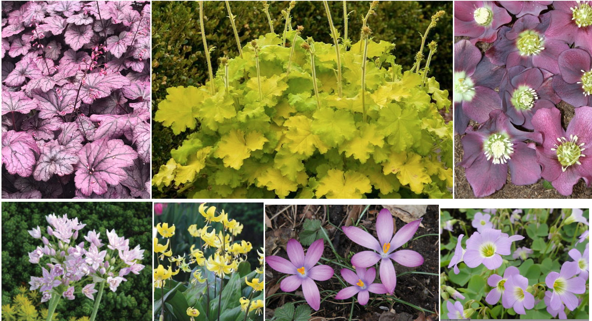

# Front window garden 

See also [details about the front porch of the house](../../Home/Front%20porch/index.md)

## 2020 Mood board

On the top row:

* Saxifragaceae: Heuchera 'Electric Plum' PP 29,924 10" tall x 18" wide clumps
* Saxifragaceae: Heuchera x 'Lemon Love' PP 31,223 13" tall x 50" wide
* Ranunculaceae: Helleborus X 'Winter Delights Violet' (lenten rose)  15" tall
  * Bloomtime: winter

On the second row: 

* Allium - unifolium (Fall items shipped 9-15 to 12-15)
    * Bloomtime: Early Summer
* Crocus-Spring - tommasinianus 'Roseus' (Fall items shipped 9-15 to 12-15)
    * Bloomtime: Very Early Spring, Winter
* Erythronium - Pagoda (Fall items shipped 9-15 to 12-15)
    * Bloomtime: Mid Spring
* Oxalidaceae: Oxalis violacea (violet wood sorrel)
    * Bloomtime April, May, June

## History

### Original planting

This image from 2020, before the removal of the azaleas.

2020-08-11 cut back the _Rhododendron spp._ (azaleas) as they are highly flammable and  develeped an infection. The absence of shrubbery does not look “naked” — I don’t think we need the _Dirca palustris_ (Leatherwood) or a witch hazel to anchor the corner.
