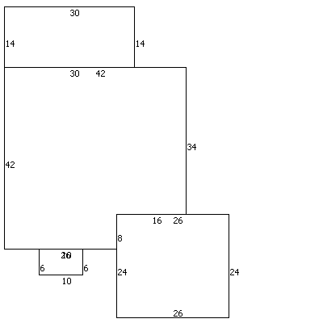

# Request for proposals

We are homeowners looking for contractors to assist with remedying carpenter bee damage to a 1996 unfinished cedar siding home plus some exterior finish maintenance. We will work with an exterminator to have the holes treated to kill any bees in the siding, and will want to begin with filling the holes and painting several days later. However, we are open to considering replacing wood in some cases and in other places woodpecker damage means replacement is probably necessary. Replacement can come before treatment. After treatment and all holes are filled or replacements are complete, there is painting work and we would like the cedar siding washed.

We are open to a number of different solutions to particular problems. For example, the soffits could be covered with aluminum or vinyl or the exposed wood of the soffits could be painted. At this time, we prefer painting. 

## Project dimensions

Using the tax appraisal sketch for dimensions, the exterior footprint of the parts of the house with siding is 248 linear feet in circumference.  There are 123 linear foot of eaves and 143 linear foot of gables (total is not the same as siding circumference because of porches and an odd roofing bit). It is a one story home.

[PDF sketch marking eves and gables](./EvesAndGablesSketch.pdf)

## Project elements

1. Inspect all siding for carpenter bee holes; fill holes. Possibly one siding section will need a section replaced with new rough cut cedar siding. (Open to advice about any other siding issues observed.)
2. One exterior corner trim piece needs to be replaced. Open to non-cedar replacement of the north east exterior corner because the downspout obscures the front view of the corner trim.
3. Other four exterior corner trim need to be inspected and holes filled. Three of the corners have downspouts that will need to be removed and replaced. We may need to replace the trim with more rough cut cedar.
4. Inspect all fascia along the gables for bee holes, fill holes. Some of the fascia will likely need replacements. We would like to consider live edge rough cut cedar on the two front facing gables if replacement is necessary. We purchased live edge rough cut 1" thick cedar from a mill south of Pittsboro in 2021.
5. Inspect all soffits for bee holes; fill holes.
6. Inspect the 6' x 10' front porch ceiling for bee holes; fill holes.
7. One tall interior corner trim piece needs to be replaced because of roof rain run-off. We would welcome replacing with some material that will deal with the dampness.
8. Paint soffits (brown to match gutters).
9. Paint 6' x 10' front porch ceiling (pale blue green grey).
10. Clean the front door and side lights, treat the mildew. Presumably the exterior door and sidelight can be painted (peach).
11. Clean the deck French doors, treat the mildew. Presumably the doors can be painted. (To be determined.)
12. Clean the garage back door. Presumably the door can be painted. (To be determined.)
13. Clean the unfinished but presumably pressure treated 15'x14' deck and railings.  Very worn wood needs treatment (possible sections replaced). Paint decking and railing.
14. Wash the siding probably with some oxy-bleach mix. We have concerns about any pressure washing of the siding, both water intrusion and wood damage.
