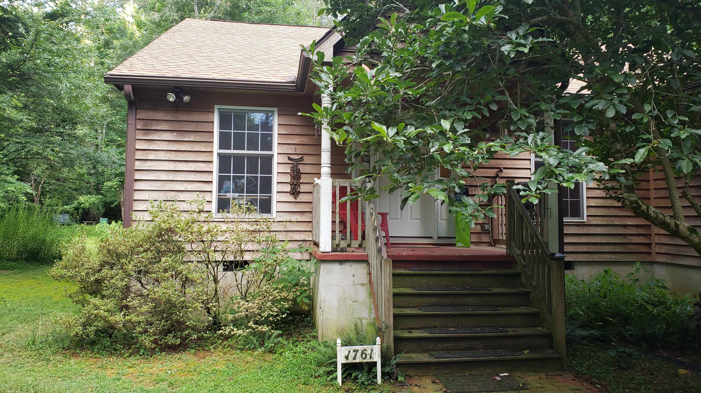
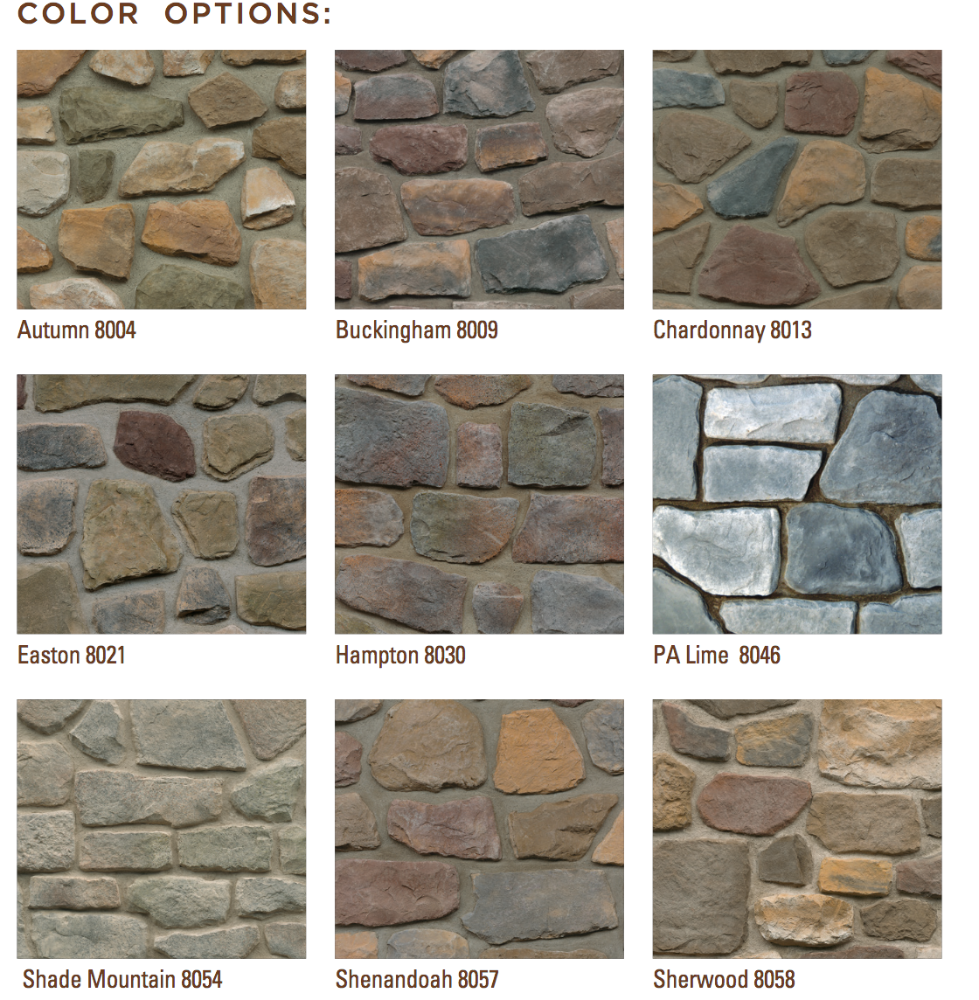
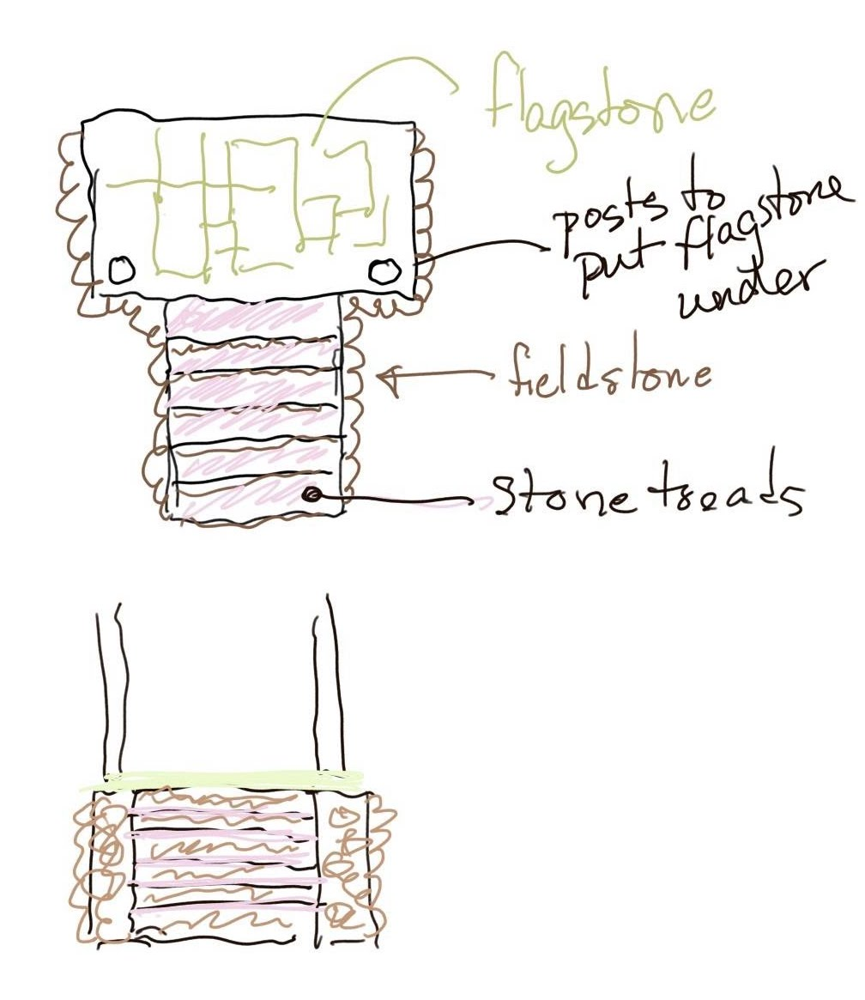
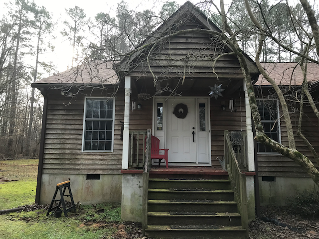
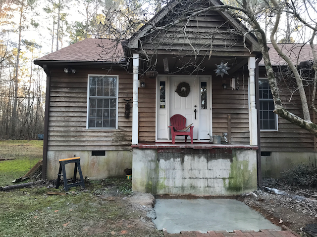

# New front steps project

## Original appearance

The front porch area, essentially as it was when we bought the house.

Note:

- azaleas under front room window
- wooden steps
- white turned posts
- red painted concrete porch floor
- plaster around walls of porch

## Planning

Our preference, in order, Autumn, Chardonnay, or Shenandoah. In phone call with mason on 2020-12-23 I understood him to say getting this stone would take 4-6 weeks, but he could get the "middle" stone.

My attempt to document the work to be done, when the mason misunder

## Execution

### Day 1, 2020-12-28

Before the day's work:

After the day's work: removal of steps and railing, excavation of footing, concrete pad, beginning of cutting off the overhang of the porch concrete slab.
 