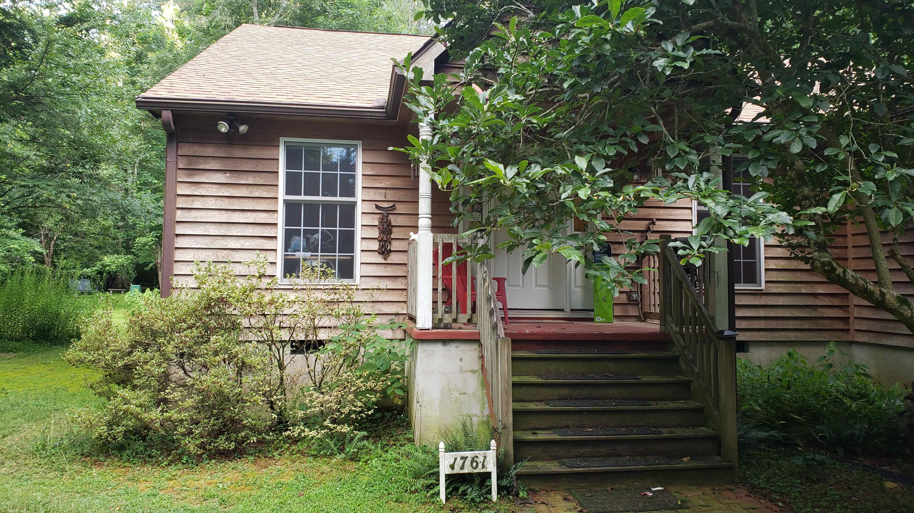

# New front steps project

## Original appearance

The front porch area, essentially as it was when we bought the house. Photo taken with iPad Pro on 2020-07-10 11:04 am.

Note:
- azaleas under front room window
- wooden steps
- white turned posts
- red painted concrete porch floor
- plaster around walls of porch

## Front window garden changes

2020-08-11 cut back the _Rhododendron spp._ (azaleas) as they are highly flammable and  develeped an infection. The absence of shrubbery does not look “naked” — I don’t think we need the _Dirca palustris_ (Leatherwood) or a witch hazel to anchor the corner. 
