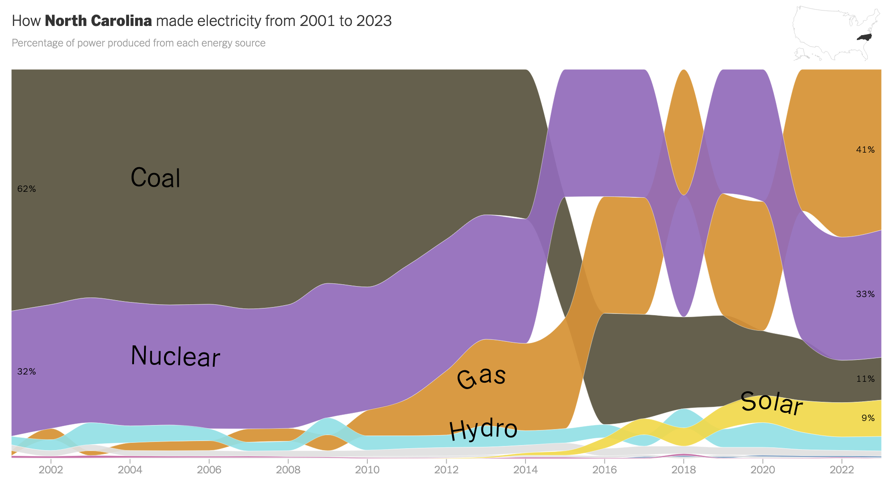

# Solar power

## Duke power

### [_How Does Your State Make Electricity?_ Nadja Popovich, Aug. 2, 2024 NYTimes](https://www.nytimes.com/interactive/2024/08/02/climate/electricity-generation-us-states.html)

> Coal-fired power plants provided the majority of North Carolina’s electricity generation during the 2000s, but 32 of the state’s coal-burning units have been retired since 2010 and coal’s share in the state electricity mix has dwindled. Natural gas, meanwhile, has surged to become North Carolina’s top source of power, generating more than 40 percent of the state’s electricity last year.
>
> North Carolina also gets nearly a tenth of its power from solar. The state’s unique implementation of a decades-old federal mandate, the Public Utility Regulatory Policies Act of 1978, helped encourage the development of utility-scale solar projects, but the growth of solar power has slowed in recent years.
>
> In 2021, a bipartisan bill passed by state lawmakers required North Carolina’s largest utility, Duke Energy, to achieve a 70 percent reduction in carbon dioxide emissions from 2005 levels by the end of the decade. But this year, Duke Energy asked for more time to meet that deadline and for permission to build a fleet of new gas-burning power plants.

